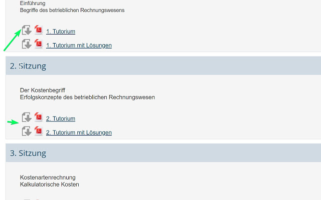

# moodleup-chrome

[Chrome Webstore](https://chrome.google.com/webstore/detail/moodleup/ggldoinnlhmnomkbjgnadclphembhemd)

A chrome plugin that aims to add small features to make working with moodleup easier.

Create issues/fork if you have any more ideas.

## features

- add download button to overview page to directly download files
- change links to redirect to content, saves a click

